<h1 align="center">Confidential Economic Engine (CEE)</h1>

<p align="center">
  
  
  
  
  
</p>

<p align="center">
  <strong>A reusable, privacy-first economic coordination layer for Solana</strong><br>
  <i>Enabling confidential payments, treasuries, and sealed economic flows using Inco Lightning FHE</i>
</p>

<p align="center">
  <b>Program ID (Devnet):</b> <code>BpZDexTuoFCrLyxEkD7tv2jRotJGVtCpyuhDReeWvEN4</code>
</p>

---


## Why CEE Exists

### The Fundamental Problem

Imagine you're building:

- **A DAO** that wants to pay contributors without revealing its entire treasury balance
- **A payroll system** where employees should see their salary, but not their colleagues'
- **A sealed-bid auction** where bids must stay secret until the reveal phase
- **A prediction market** where pool sizes shouldn't influence betting behavior
- **A grant program** that distributes funds without exposing individual award amounts

**None of these can exist on today's public blockchains** without severe privacy compromises.

### Why This Matters Now

The Web3 ecosystem is maturing beyond speculation into **real-world applications**:

| Sector | Privacy Requirement | Current Blocker |
|--------|---------------------|-----------------|
| **Corporate Treasury** | Confidential runway, strategic reserves | On-chain balances are public |
| **HR & Payroll** | Salary privacy, compensation equity | All transfers are visible |
| **Legal Compliance** | Regulatory reporting without full disclosure | No selective transparency |
| **Competitive Markets** | Strategic trading, M&A activity | MEV, front-running |
| **Consumer Apps** | User financial privacy | Every transaction is traceable |

**CEE provides the missing cryptographic infrastructure** to enable these applications on Solana while maintaining the properties that make blockchains valuable: **verifiability, composability, and permissionless access**.

---

## The Problem: Economic Intent Leakage in Web3

Blockchains provide **transparency by default**, but this creates a fundamental tension: **economic privacy is essential for real-world applications**, yet everything on-chain is public.

### What Leaks On-Chain Today

Even with "confidential" balances, critical information still leaks:

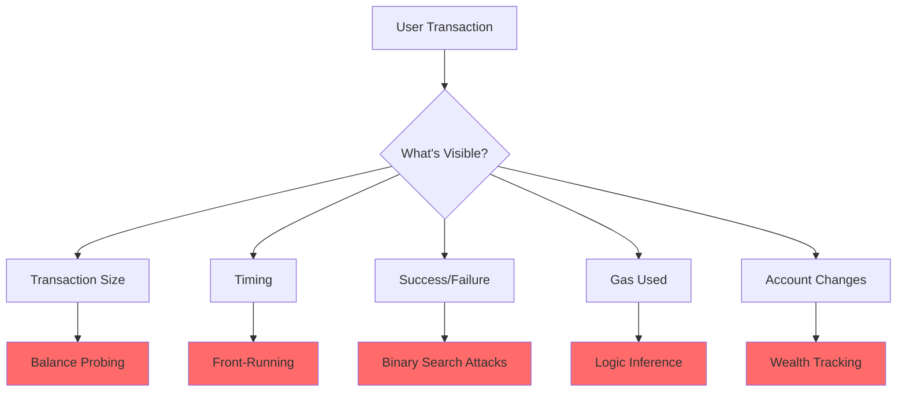

| Leaked Information | Attack Vector | Real Impact |
|-------------------|---------------|-------------|
| **Transfer amounts** | Balance probing, wealth profiling | Competitors know your revenue, users tracked |
| **Distribution timing** | Front-running economic decisions | MEV extractors profit from your strategies |
| **Treasury size** | Protocol solvency speculation | Market manipulation, coordinated attacks |
| **Fee/reward ratios** | Strategy extraction | Your economic model gets copied |
| **Success/failure signals** | Binary search attacks | Private values recovered through repeated queries |

### The Confidentiality Gap

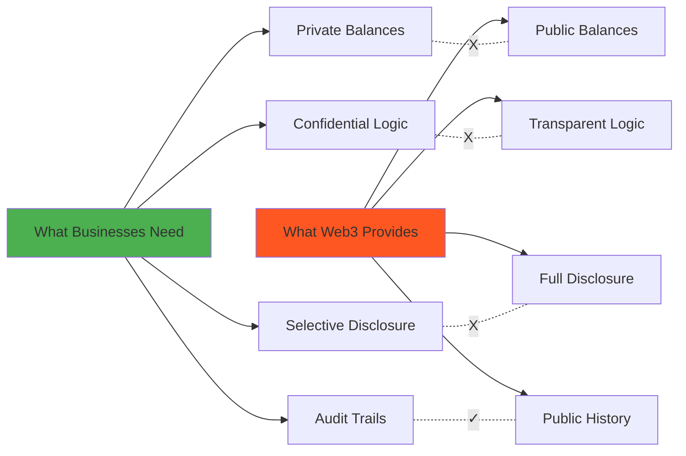

**Result:** Critical applications payroll, treasuries, auctions, regulated finance cannot be built on public blockchains without unacceptable privacy compromises.

### Why Existing Solutions Fall Short

| Solution | What It Provides | What It Lacks |
|----------|------------------|---------------|
| **SPL Token** | Fast, composable transfers | Everything is public |
| **Token-2022 Confidential** | Hidden balances | Economic logic still leaks |
| **ZK-based protocols** | Cryptographic privacy | Heavy overhead, poor UX, complex integration |
| **Off-chain computation** | Privacy through obscurity | Breaks composability, trust assumptions |
| **Mixers/Tumblers** | Transaction unlinking | Limited use cases, regulatory concerns |

**What's missing:** A way to express **economic relationships**—fees, payouts, rewards, treasuries, pools—**without revealing the numbers behind them**, while maintaining **composability, verifiability, and Solana's performance**.

---

## The Solution: Confidential Economic Engine

CEE is a **confidential economic coordination layer** built on Solana using **Inco Lightning** for Fully Homomorphic Encryption (FHE) operations.

### What CEE Does

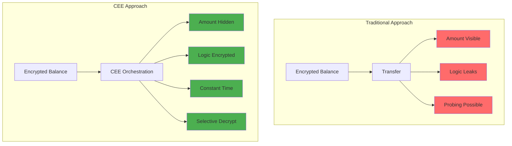

CEE does **not** mint tokens or store balances. Instead, it:

- **Orchestrates encrypted value flows** between confidential token accounts
- **Performs encrypted arithmetic** (addition, subtraction, comparison) without decryption
- **Enforces economic rules** using encrypted conditionals—no branching on secret values
- **Controls decryption permissions** via on-chain allowance PDAs

### How CEE Enables Privacy-First Applications

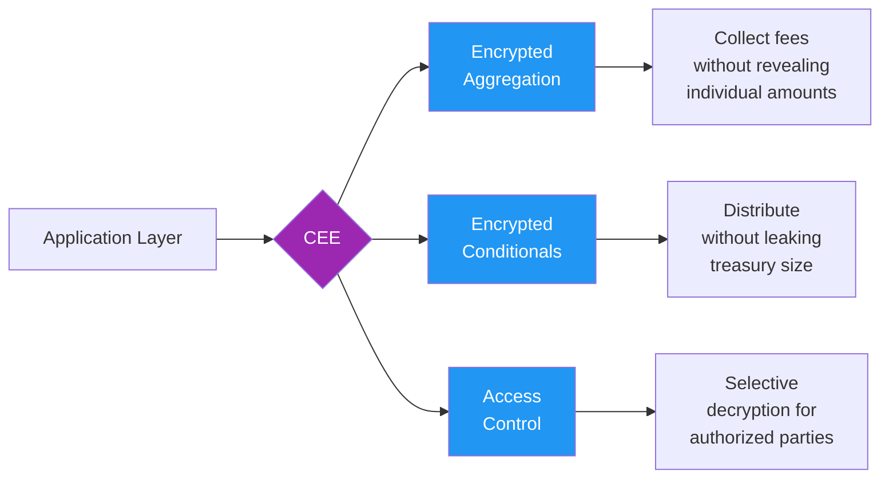

---

## Architecture

### System Stack

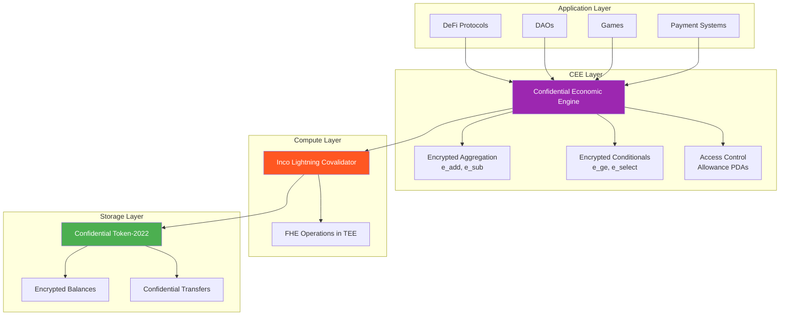

### Data Flow: Fee Collection Example

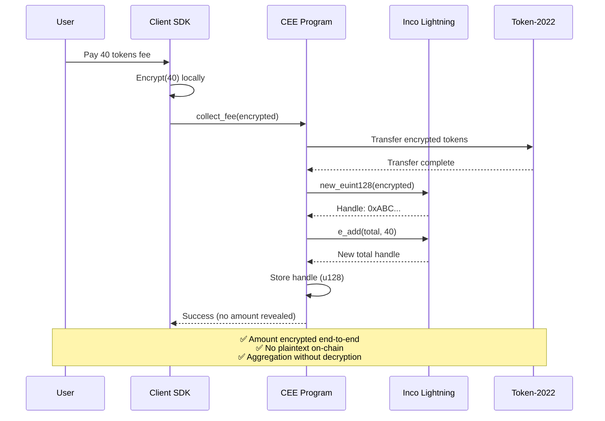

### Key Separation of Concerns

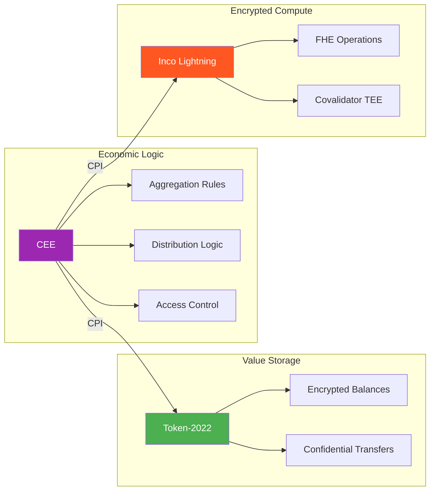

**Design principle:** Value storage (Token-2022) is decoupled from economic logic (CEE), keeping the system **composable, auditable, and reusable**.

---

## Security Model: Defense Against Information Leakage

CEE prevents common confidentiality failures through four core design principles:

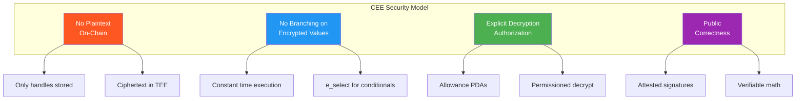

### 1. No Plaintext On-Chain

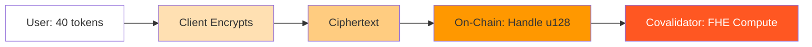

- Programs **never see balances or amounts**
- Only encrypted handles (`u128`) are stored on-chain
- Ciphertext lives in the covalidator TEE

```rust
#[account]
pub struct FeeVault {
    pub total_fees_handle: u128,           // Encrypted handle, NOT plaintext
    pub pending_distribution_handle: u128,  // Encrypted handle, NOT plaintext
    // No plaintext amounts anywhere
}
```

### 2. No Branching on Encrypted Values

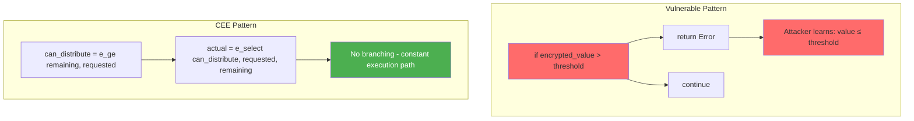

**Vulnerable approach** (leaks information):
```rust
// WRONG: Leaks information through control flow
if requested > available {
    return Err(InsufficientFunds);  // Attacker learns requested > available
}
transfer(requested);  // Binary search attack possible
```

**CEE approach** (constant-time, leak-free):
```rust
// RIGHT: CEE uses encrypted selection (no branching)
let can_distribute = e_ge(remaining, requested)?;      // Encrypted comparison
let actual = e_select(can_distribute, requested, remaining)?;  // No branching
transfer(actual);  // Same execution path regardless of values
```

### 3. Explicit Decryption Authorization

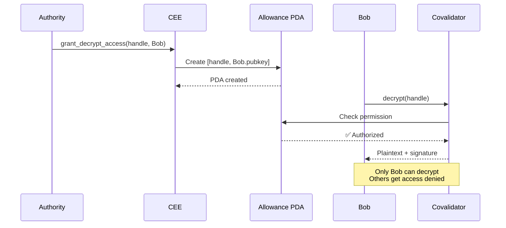

- Decryption is **permissioned**, not implicit
- On-chain allowance PDAs control who can decrypt what
- Attested decryption proves outputs are valid

```rust
pub fn grant_decrypt_access(ctx: Context<GrantDecryptAccess>, handle: u128) -> Result<()> {
    // Create allowance: [handle, allowed_address] → PDA
    allow(cpi_ctx, handle, true, ctx.accounts.allowed_address.key())?;
    Ok(())
}
```

### 4. Public Correctness

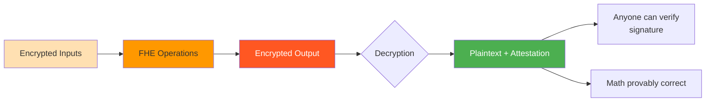

- Even though values are private, **correctness is verifiable**
- Covalidator provides attested decryption signatures
- Anyone can verify the math was done correctly without seeing the numbers

**Key insight:** Privacy ≠ Unverifiability. CEE gives you both privacy *and* proof.

---

## What Was Built

### Smart Contract Instructions

| Instruction | Purpose |
|-------------|---------|
| `initialize` | Create FeeVault PDA with encrypted handles |
| `collect_fee` | Transfer encrypted fees, aggregate via `e_add` |
| `distribute` | Conditional payout with clamping via `e_select` |
| `grant_decrypt_access` | Create allowance PDA for decryption |
| `settle_epoch` | Reset handles, close vault |

### End-to-End Flow (Tested)

```
┌─────────────────────────────────────────────────────────────────┐
│  1. SETUP                                                        │
│     • Create confidential token mint (Token-2022)               │
│     • Initialize token accounts for users + vault                │
│     • Initialize FeeVault PDA                                    │
├─────────────────────────────────────────────────────────────────┤
│  2. FEE COLLECTION                                               │
│     • Alice encrypts 40 tokens client-side (JS SDK)             │
│     • Alice calls collect_fee → confidential transfer to vault  │
│     • CEE aggregates encrypted total via e_add                  │
│     • Bob encrypts 50 tokens, calls collect_fee                 │
│     • Vault now holds encrypted(40 + 50) = encrypted(90)        │
├─────────────────────────────────────────────────────────────────┤
│  3. DISTRIBUTION (with clamping)                                 │
│     • Authority requests encrypted(30) distribution to Bob      │
│     • CEE computes: remaining = total - pending                 │
│     • CEE checks: can_distribute = (remaining >= requested)     │
│     • CEE selects: actual = can_distribute ? requested : remaining │
│     • Confidential transfer of actual amount to Bob             │
│     • NO LEAK: Even if request exceeds balance, no failure signal │
├─────────────────────────────────────────────────────────────────┤
│  4. ACCESS CONTROL                                               │
│     • Authority grants Bob decryption permission                │
│     • Allowance PDA created: [handle, bob_pubkey]               │
│     • Only Bob can now decrypt his payout amount                │
├─────────────────────────────────────────────────────────────────┤
│  5. DECRYPTION & VERIFICATION                                    │
│     • Bob calls decrypt() via covalidator                       │
│     • Attested decryption returns plaintext: 30 tokens          │
│     • Bob verifies amount matches expectation                   │
│     • Others cannot decrypt—access control enforced             │
├─────────────────────────────────────────────────────────────────┤
│  6. SETTLEMENT                                                   │
│     • Authority calls settle_epoch                              │
│     • Handles reset to 0, vault marked closed                   │
│     • Ready for next epoch                                      │
└─────────────────────────────────────────────────────────────────┘
```

### Test Results

```
CEE – Phase-5 Full E2E
  ✔ Initialize confidential token mint (1749ms)
  ✔ Initialize confidential token accounts (4100ms)
  ✔ Mint encrypted balance to Alice (797ms)
  ✔ Initialize FeeVault (2107ms)
  ✔ Alice pays encrypted fee
  ✔ Authority distributes encrypted payout to Bob
  ✔ Grant Bob decryption permission
  ✔ Bob decrypts payout correctly
  ✔ Settle epoch

  9 passing (20s)
```

### E2E Flow Visualization

```mermaid
graph LR
    subgraph "Phase 1: Setup"
        direction TB
        S1[Create Token Mint] --> S2[Create Token Accounts]
        S2 --> S3[Initialize FeeVault PDA]
    end
    
    subgraph "Phase 2: Collection"
        direction TB
        C1[Alice encrypts<br/>40 tokens] --> C2[collect_fee]
        C2 --> C3[Transfer +<br/>e_add]
        C3 --> C4[Bob encrypts<br/>50 tokens]
        C4 --> C5[collect_fee]
        C5 --> C6[Total:<br/>encrypted 90]
    end
    
    subgraph "Phase 3: Distribution"
        direction TB
        D1[Authority encrypts<br/>30 tokens] --> D2[distribute]
        D2 --> D3[e_sub:<br/>remaining]
        D3 --> D4[e_ge:<br/>can_distribute?]
        D4 --> D5[e_select:<br/>clamp]
        D5 --> D6[Transfer<br/>to Bob]
    end
    
    subgraph "Phase 4: Access & Decrypt"
        direction TB
        A1[grant_decrypt<br/>_access] --> A2[Create<br/>allowance PDA]
        A2 --> A3[Bob calls<br/>decrypt]
        A3 --> A4[Verify:<br/>30 tokens]
    end
    
    subgraph "Phase 5: Settlement"
        direction TB
        E1[settle_epoch] --> E2[Reset<br/>handles]
        E2 --> E3[Close<br/>vault]
    end
    
    S3 --> C1
    C6 --> D1
    D6 --> A1
    A4 --> E1
    
    style C6 fill:#4CAF50,color:#fff
    style D5 fill:#FF5722,color:#fff
    style A4 fill:#9C27B0,color:#fff
```

### Privacy Guarantees Demonstrated

| What's Hidden | How CEE Protects It | Test Verification |
|---------------|---------------------|-------------------|
| Individual fee amounts | Client-side encryption | Only handles stored on-chain |
| Total vault balance | Encrypted aggregation | `total_fees_handle` is u128, not plaintext |
| Distribution amounts | Encrypted transfer | Transaction succeeds without revealing amount |
| Clamping logic | No branching (e_select) | Same execution path if request > available |
| Who can decrypt | Allowance PDA | Only Bob can decrypt after grant |

---

## Real-World Applications

CEE is a **reusable primitive** that enables confidential economic coordination across multiple verticals. Here's how different industries can leverage it:

### Application Matrix

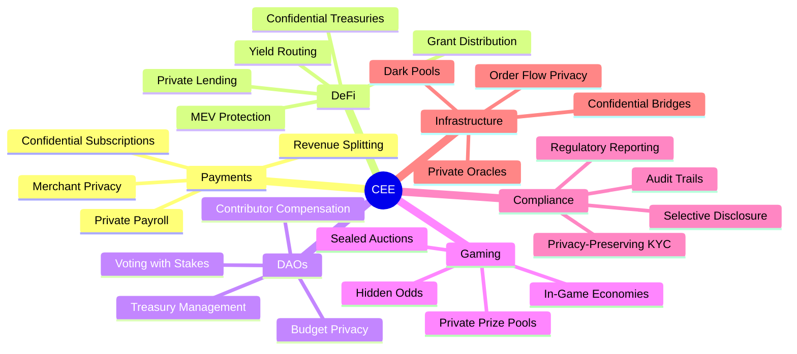

---

### Payments & Payroll

#### Private Payroll Systems

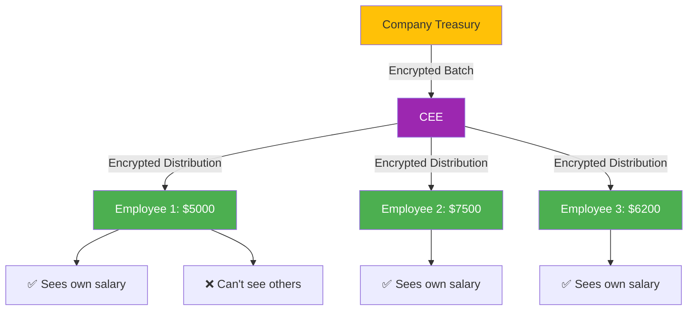

| Challenge | CEE Solution |
|-----------|--------------|
| Salary transparency creates workplace tension | Each employee only decrypts their own amount |
| Total payroll exposes company runway | Aggregate encrypted—outsiders see nothing |
| Timing attacks reveal pay cycles | Constant-time execution prevents inference |

#### Confidential Subscriptions

| Use Case | Traditional Web3 | With CEE |
|----------|------------------|----------|
| Netflix-style streaming | Everyone sees payment amounts | Service verifies payment, amount private |
| SaaS subscriptions | Competitors track customer spend | Payment confirmed, tier hidden |
| Premium memberships | Whale identification easy | Membership verified, level private |

---

### DeFi & DAOs

#### Confidential Treasuries

```mermaid
graph TB
    subgraph "Traditional DAO Treasury"
        T1[Public Balance: $10M] --> T2[❌ Everyone knows runway]
        T2 --> T3[❌ Strategic decisions leaked]
        T3 --> T4[❌ Competitors front-run]
    end
    
    subgraph "CEE-Powered Treasury"
        C1[Encrypted Balance] --> C2[✅ Spending without exposure]
        C2 --> C3[✅ Strategic flexibility]
        C3 --> C4[✅ Selective disclosure to auditors]
    end
    
    style T1 fill:#ff6b6b
    style T2 fill:#ff6b6b
    style T3 fill:#ff6b6b
    style T4 fill:#ff6b6b
    style C2 fill:#4CAF50,color:#fff
    style C3 fill:#4CAF50,color:#fff
    style C4 fill:#4CAF50,color:#fff
```

**Real scenario:** A DAO with a $10M treasury wants to acquire a competitor. If the treasury size is public, the target can demand a premium. With CEE:

1. DAO proposes acquisition using encrypted offer
2. Target sees encrypted commitment (provably funded)
3. Negotiation happens without exposing treasury size
4. Final amount revealed only to counterparty

#### Grant Distribution

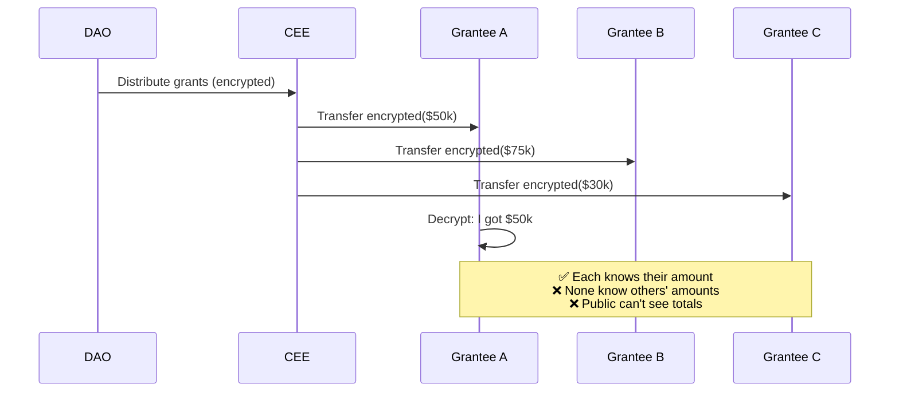

**Why this matters:**
- Prevents "grant envy" in contributor communities
- Stops competitors from poaching top contributors
- Enables merit-based compensation without social pressure

---

### Gaming & Prediction Markets

#### Sealed-Bid Auctions

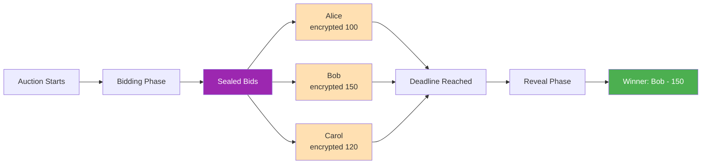

**CEE ensures:**
- ✅ Bids hidden until reveal
- ✅ No bid sniping
- ✅ Fair price discovery

**Traditional NFT auction problem:**
- Last-minute bid sniping
- Frontrunning on high bids
- Fake bids to probe max price

**CEE solution:**
- Bids encrypted until reveal block
- No information leakage during bidding
- Winner selection computed on encrypted values

#### Private Prize Pools

| Game Mechanic | Without CEE | With CEE |
|---------------|-------------|----------|
| Tournament prize | Pool size influences entry behavior | Hidden until distribution |
| Loot box odds | Players game the system | Provably fair, unmanipulatable |
| Player rankings | Full leaderboard | Know your rank, not others' scores |

---

### Infrastructure & Compliance

#### MEV-Resistant DEX

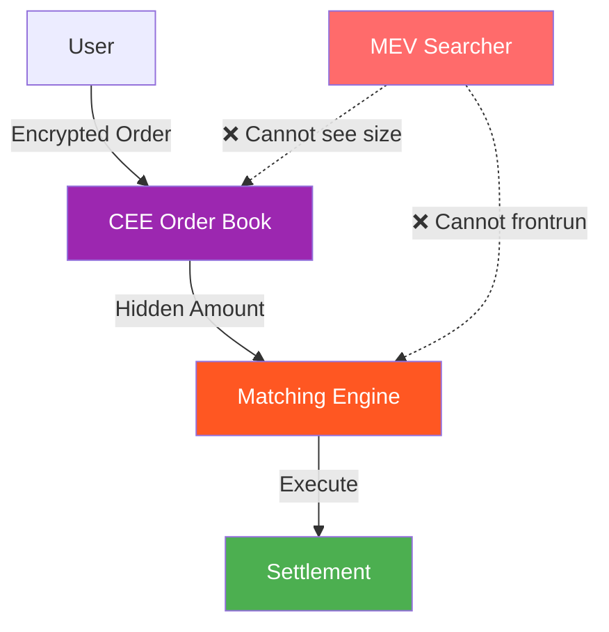

**Traditional DEX:** Order sizes are public → MEV bots sandwich attack

**CEE-powered DEX:** Order sizes encrypted → MEV impossible

#### Regulatory Compliance

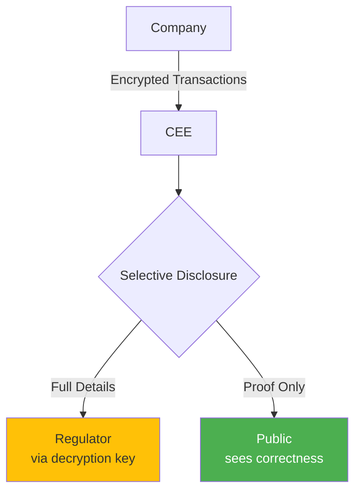

**Use case:** Financial institution needs to:
- Prove solvency to regulators
- Keep customer balances private
- Maintain audit trail

**CEE enables:**
- Encrypted operations with public correctness proofs
- Selective decryption for authorized auditors
- Privacy-preserving compliance

---

## Integration Guide

### For Protocol Developers

CEE is designed as a **composable primitive**. Integrate it into your protocol:

```typescript
// 1. Client-side: Encrypt the amount
import { encryptValue, hexToBuffer } from "@inco/solana-sdk";

const encryptedFee = await encryptValue(40n * 10n ** 6n);  // 40 tokens
const buffer = hexToBuffer(encryptedFee);

// 2. Call CEE instruction
await program.methods
  .collectFee(buffer, 6)  // decimals = 6
  .accounts({
    payer: userPublicKey,
    feeVault: feeVaultPda,
    fromToken: userTokenAccount,
    vaultTokenAccount: vaultTokenAccount,
    tokenMint: mintPublicKey,
    incoTokenProgram: INCO_TOKEN_PROGRAM_ID,
    incoLightningProgram: INCO_LIGHTNING_PROGRAM_ID,
    systemProgram: SystemProgram.programId,
  })
  .signers([userKeypair])
  .rpc();
```

### For Users

```typescript
// Decrypt your payout (only works if you have permission)
import { decrypt } from "@inco/solana-sdk";

const result = await decrypt([handle], { wallet, connection });
const plaintext = BigInt(result.plaintexts[0]);  // Your actual payout amount
```

---

## Quick Start

### Prerequisites

- Solana CLI v1.18+
- Anchor v0.31.1
- Node.js v18+
- Rust (nightly)

### Installation

```bash
# Clone the repo
git clone https://github.com/Rahul-Prasad-07/Confidential-Economic-Engine.git
cd Confidential-Economic-Engine

# Install dependencies
yarn install

# Build the program
yarn build

# Deploy to devnet
yarn deploy

# Run tests (without redeploying)
yarn test
```

### Configuration

Update `Anchor.toml` for your target cluster:

```toml
[provider]
cluster = "devnet"
wallet = "~/.config/solana/id.json"

[programs.devnet]
confidential_economic_engine = "BpZDexTuoFCrLyxEkD7tv2jRotJGVtCpyuhDReeWvEN4"
```

### Testing & Verification

The test suite (`tests/confidential-economic-engine.ts`) verifies:

- ✅ Confidential token mint and account initialization
- ✅ Encrypted fee collection with aggregation
- ✅ Conditional distribution with clamping logic
- ✅ Decryption access control enforcement
- ✅ Epoch settlement

**Run tests:**
```bash
yarn test
```

**Expected output:** 9 passing tests in ~20 seconds

---

### Phase 1: Core Engine 
- [x] FeeVault initialization with encrypted handles
- [x] Encrypted fee collection with aggregation
- [x] Conditional distribution with clamping
- [x] Decryption access control via allowance PDAs
- [x] Epoch settlement logic
- [x] Full E2E test suite

### Phase 2: Reference Applications
- [ ] Confidential Treasury (DAO spending)
- [ ] Sealed-Bid Auction
- [ ] Private Payroll System

### Phase 3: Developer Experience
- [ ] SDK wrapper for common patterns
- [ ] React hooks for encryption/decryption
- [ ] CLI tools for testing
- [ ] Documentation portal

### Phase 4: Ecosystem Integration
- [ ] Multi-token support
- [ ] Cross-program composability
- [ ] Mainnet deployment
- [ ] Audit & security review

---

## Key Takeaway

```mermaid
graph LR
    A[SPL Token] --> B[Public Economic<br/>Primitive]
    C[CEE] --> D[Confidential Economic<br/>Primitive]
    
    B --> B1[✅ Fast]
    B --> B2[✅ Composable]
    B --> B3[❌ No Privacy]
    
    D --> D1[✅ Fast]
    D --> D2[✅ Composable]
    D --> D3[✅ Private]
    
    style A fill:#4CAF50,color:#fff
    style C fill:#9C27B0,color:#fff
```

> **CEE doesn't just hide balances. It enables private economic coordination.**

This is the missing layer between public blockchains and real-world financial systems that require confidentiality by default.

| Primitive | Purpose | When to Use |
|-----------|---------|-------------|
| **SPL Token** | Public value transfer | Open markets, transparent systems |
| **CEE** | Confidential value coordination | Payroll, treasuries, auctions, anything requiring privacy |

**Vision:** CEE aims to become the standard **confidential economic primitive on Solana**, enabling a new class of privacy-first applications while maintaining the performance and composability that makes Solana unique.


## Team

Built with Inco for the Solana ecosystem.

---

<p align="center">
  <b>Confidential Economic Engine</b><br>
  <i>Private value flows. Public correctness.</i>
</p>
