Okey now first go through all docs for svm 

You can take this as reference if needed 

- https://docs.inco.org/svm/home 
- https://docs.inco.org/svm/introduction

- https://docs.inco.org/svm/rust-sdk/overview
- https://docs.inco.org/svm/tutorials/confidential-spl-token/overview
- https://docs.inco.org/svm/tutorials/private-raffle/overview
- https://docs.inco.org/svm/js-sdk/overview

- https://github.com/Inco-fhevm/lightning-rod-solana
- https://github.com/Inco-fhevm/nextjs-template-svm

- https://github.com/Inco-fhevm/raffle-example-solana

and i have pasted some of the docs below and github repos of solana from inco.


Docs ——-> 

# Input & Encryption

> How to encrypt input data for Solana programs

# Input & Encryption

To create an encrypted value, use `new_euint128` or `new_ebool` with client-encrypted ciphertext.

## Creating Encrypted Values (Program Side)

```rust  theme={null}
pub fn deposit(
    ctx: Context<Deposit>,
    ciphertext: Vec<u8>,  // Client-encrypted amount
) -> Result<()> {
    // Create CPI context
    let cpi_ctx = CpiContext::new(
        ctx.accounts.inco_lightning_program.to_account_info(),
        Operation {
            signer: ctx.accounts.authority.to_account_info(),
        },
    );

    // Create encrypted handle from ciphertext
    let encrypted_amount: Euint128 = new_euint128(cpi_ctx, ciphertext, 0)?;

    // Store the handle
    ctx.accounts.vault.balance = encrypted_amount;

    // IMPORTANT: After creating a new handle, grant decryption access
    // to the appropriate address using the `allow` function.
    // See the Access Control guide for details.

    Ok(())
}
```

## Input Functions

| Function       | Description                                                  | Signature                                       |
| -------------- | ------------------------------------------------------------ | ----------------------------------------------- |
| `new_euint128` | Create encrypted u128 from client-encrypted ciphertext       | `(CpiContext, Vec<u8>, u8) -> Result<Euint128>` |
| `new_ebool`    | Create encrypted bool from client-encrypted ciphertext       | `(CpiContext, Vec<u8>, u8) -> Result<Ebool>`    |
| `as_euint128`  | Convert plaintext u128 to encrypted handle (trivial encrypt) | `(CpiContext, u128) -> Result<Euint128>`        |
| `as_ebool`     | Convert plaintext bool to encrypted handle (trivial encrypt) | `(CpiContext, bool) -> Result<Ebool>`           |

<Note>
  The last parameter in `new_euint128`/`new_ebool` identifies whether the input is ciphertext (`0`) or plaintext (`1`). Always pass `0` when working with client-encrypted data.
</Note>

## Trivial Encryption

Use `as_euint128` and `as_ebool` to convert plaintext values to encrypted handles directly in your program. This is useful for constants or program-generated values.

```rust  theme={null}
pub fn initialize_with_zero(
    ctx: Context<Initialize>,
) -> Result<()> {
    let cpi_ctx = CpiContext::new(
        ctx.accounts.inco_lightning_program.to_account_info(),
        Operation {
            signer: ctx.accounts.authority.to_account_info(),
        },
    );

    // Create encrypted zero
    let zero: Euint128 = as_euint128(cpi_ctx, 0)?;

    ctx.accounts.account.balance = zero;

    // IMPORTANT: Grant decryption access to the owner if this handle
    // needs to be decrypted later. See Access Control guide.

    Ok(())
}
```

<Warning>
  Trivial encryption should only be used for public constants (like zero) or values that don't need to be secret. For user-provided sensitive values, always use client-side encryption with `new_euint128`.
</Warning>

## Client-Side Encryption

Values must be encrypted client-side before sending to your program. Use the [JavaScript SDK](/svm/js-sdk/encryption) to encrypt values:

```typescript  theme={null}
import { encryptValue } from '@inco/solana-sdk/encryption';

const encrypted = await encryptValue(100n);
await program.methods
  .deposit(Buffer.from(encrypted, 'hex'))
  .rpc();
```

<Note>
  See the [JavaScript SDK Encryption documentation](/svm/js-sdk/encryption) for supported types and error handling.
</Note>


---

> To find navigation and other pages in this documentation, fetch the llms.txt file at: https://docs.inco.org/llms.txt


# Operations

> Operations available on encrypted data

# Operations

Inco Lightning provides arithmetic, comparison, and bitwise operations on encrypted values.

## Arithmetic Operations

All arithmetic operations return an `Euint128`.

| Function | Description    | Signature                          |
| -------- | -------------- | ---------------------------------- |
| `e_add`  | Addition       | `(Euint128, Euint128) -> Euint128` |
| `e_sub`  | Subtraction    | `(Euint128, Euint128) -> Euint128` |
| `e_mul`  | Multiplication | `(Euint128, Euint128) -> Euint128` |
| `e_rem`  | Remainder      | `(Euint128, Euint128) -> Euint128` |

### Example: Encrypted Addition

```rust  theme={null}
pub fn add_balances(
    ctx: Context<AddBalances>,
    amount_a: Euint128,
    amount_b: Euint128,
) -> Result<()> {
    let cpi_ctx = CpiContext::new(
        ctx.accounts.inco_lightning_program.to_account_info(),
        Operation {
            signer: ctx.accounts.authority.to_account_info(),
        },
    );

    // Add two encrypted values
    let result: Euint128 = e_add(cpi_ctx, amount_a, amount_b, 0)?;

    ctx.accounts.account.total = result;

    // IMPORTANT: After storing the result handle, grant decryption access
    // to the appropriate address (e.g., owner) using the `allow` function.
    // See the Access Control guide for details.

    Ok(())
}
```

## Comparison Operations

Comparison operations return an `Ebool`.

| Function | Description           | Signature                       |
| -------- | --------------------- | ------------------------------- |
| `e_ge`   | Greater than or equal | `(Euint128, Euint128) -> Ebool` |
| `e_gt`   | Greater than          | `(Euint128, Euint128) -> Ebool` |
| `e_le`   | Less than or equal    | `(Euint128, Euint128) -> Ebool` |
| `e_lt`   | Less than             | `(Euint128, Euint128) -> Ebool` |
| `e_eq`   | Equal                 | `(Euint128, Euint128) -> Ebool` |

## Bitwise Operations

| Function | Description | Signature                          |
| -------- | ----------- | ---------------------------------- |
| `e_and`  | Bitwise AND | `(Euint128, Euint128) -> Euint128` |
| `e_or`   | Bitwise OR  | `(Euint128, Euint128) -> Euint128` |
| `e_not`  | Bitwise NOT | `(Euint128) -> Euint128`           |
| `e_shl`  | Shift left  | `(Euint128, Euint128) -> Euint128` |
| `e_shr`  | Shift right | `(Euint128, Euint128) -> Euint128` |

## CPI Context Pattern

All operations require a CPI context with the Inco Lightning program:

```rust  theme={null}
let cpi_ctx = CpiContext::new(
    ctx.accounts.inco_lightning_program.to_account_info(),
    Operation {
        signer: ctx.accounts.authority.to_account_info(),
    },
);

let result = e_add(cpi_ctx, a, b, 0)?;

// IMPORTANT: Define allowance rules after each operation that produces
// a handle you want to decrypt later. See Access Control guide.
```

<Note>
  The last parameter in operation calls identifies whether the left-hand side operand is ciphertext (`0`) or plaintext (`1`). Always pass `0` when working with encrypted handles.
</Note>


---

> To find navigation and other pages in this documentation, fetch the llms.txt file at: https://docs.inco.org/llms.txt


# Random Number Generation

> Generate encrypted random numbers on-chain

# Random Number Generation

Inco Lightning provides on-chain encrypted random number generation through the `e_rand` function. This enables use cases like lotteries, games, fair distribution, and any application requiring unpredictable values.

## Overview

| Function | Description                      | Signature                              |
| -------- | -------------------------------- | -------------------------------------- |
| `e_rand` | Generate encrypted random number | `(CpiContext, u8) -> Result<Euint128>` |

The generated random value is encrypted and cannot be predicted or known until decrypted by an authorized party.

## Basic Usage

```rust  theme={null}
use anchor_lang::prelude::*;
use inco_lightning::cpi::accounts::Operation;
use inco_lightning::cpi::e_rand;
use inco_lightning::types::Euint128;
use inco_lightning::ID as INCO_LIGHTNING_ID;

pub fn generate_random(ctx: Context<GenerateRandom>) -> Result<()> {
    let cpi_ctx = CpiContext::new(
        ctx.accounts.inco_lightning_program.to_account_info(),
        Operation {
            signer: ctx.accounts.authority.to_account_info(),
        },
    );

    // Generate encrypted random number
    let random_value: Euint128 = e_rand(cpi_ctx, 0)?;

    ctx.accounts.account.random = random_value;
    Ok(())
}
```

<Note>
  The second parameter identifies whether the operand is ciphertext (`0`) or plaintext (`1`). Always pass `0` when working with encrypted handles.
</Note>

## Account Structure

```rust  theme={null}
#[derive(Accounts)]
pub struct GenerateRandom<'info> {
    #[account(mut)]
    pub authority: Signer<'info>,

    #[account(mut)]
    pub account: Account<'info, MyAccount>,

    /// CHECK: Inco Lightning program for encrypted operations
    #[account(address = INCO_LIGHTNING_ID)]
    pub inco_lightning_program: AccountInfo<'info>,
}

#[account]
pub struct MyAccount {
    pub random: Euint128,
}
```

## Use Cases

### Fair Lottery Selection

```rust  theme={null}
pub fn select_winner(ctx: Context<SelectWinner>) -> Result<()> {
    let cpi_ctx = CpiContext::new(
        ctx.accounts.inco_lightning_program.to_account_info(),
        Operation {
            signer: ctx.accounts.authority.to_account_info(),
        },
    );

    // Generate random value for winner selection
    let random_index: Euint128 = e_rand(cpi_ctx, 0)?;

    ctx.accounts.lottery.winner_index = random_index;
    Ok(())
}
```

### Random Game Outcomes

```rust  theme={null}
pub fn roll_dice(ctx: Context<RollDice>) -> Result<()> {
    let cpi_ctx = CpiContext::new(
        ctx.accounts.inco_lightning_program.to_account_info(),
        Operation {
            signer: ctx.accounts.authority.to_account_info(),
        },
    );

    // Generate random dice roll
    let dice_result: Euint128 = e_rand(cpi_ctx, 0)?;

    ctx.accounts.game.last_roll = dice_result;
    Ok(())
}
```

## Security Properties

* **Unpredictable**: Random values cannot be predicted before generation
* **Encrypted**: Results are encrypted and only visible to authorized parties
* **Verifiable**: Decryption requires attestation from the covalidator network

<Warning>
  The random value remains encrypted until decryption is requested. Ensure proper access control is set up before allowing decryption of random values in sensitive applications.
</Warning>


---

> To find navigation and other pages in this documentation, fetch the llms.txt file at: https://docs.inco.org/llms.txt


# Control Flow

> Conditional logic with encrypted values

# Control Flow

The `e_select` function enables conditional logic on encrypted values without revealing the condition.

## e\_select

```rust  theme={null}
e_select(condition: Ebool, if_true: Euint128, if_false: Euint128) -> Euint128
```

Returns `if_true` when condition is encrypted true, `if_false` otherwise.

## Example: Confidential Transfer with Balance Check

```rust  theme={null}
pub fn confidential_transfer(
    ctx: Context<Transfer>,
    transfer_amount: Euint128,
) -> Result<()> {
    let inco = ctx.accounts.inco_lightning_program.to_account_info();
    let signer = ctx.accounts.authority.to_account_info();

    let source_balance = ctx.accounts.source.balance;
    let dest_balance = ctx.accounts.destination.balance;

    // Check if source has sufficient balance (encrypted comparison)
    let cpi_ctx = CpiContext::new(inco.clone(), Operation { signer: signer.clone() });
    let has_sufficient: Ebool = e_ge(cpi_ctx, source_balance, transfer_amount, 0)?;

    // Create zero for failed transfer case
    let zero = Euint128::wrap(0);

    // Select actual transfer amount: if sufficient balance, use amount; else use 0
    let cpi_ctx = CpiContext::new(inco.clone(), Operation { signer: signer.clone() });
    let actual_amount: Euint128 = e_select(cpi_ctx, has_sufficient, transfer_amount, zero, 0)?;

    // Subtract from source (will subtract 0 if insufficient)
    let cpi_ctx = CpiContext::new(inco.clone(), Operation { signer: signer.clone() });
    let new_source_balance: Euint128 = e_sub(cpi_ctx, source_balance, actual_amount, 0)?;

    // Add to destination (will add 0 if insufficient)
    let cpi_ctx = CpiContext::new(inco.clone(), Operation { signer: signer.clone() });
    let new_dest_balance: Euint128 = e_add(cpi_ctx, dest_balance, actual_amount, 0)?;

    // Update balances
    ctx.accounts.source.balance = new_source_balance;
    ctx.accounts.destination.balance = new_dest_balance;

    Ok(())
}
```

## How e\_select Works

```mermaid  theme={null}
flowchart TD
    subgraph Inputs["Encrypted Inputs"]
        A[("🔒 Condition<br/>(Ebool)")]
        B[("🔒 if_true<br/>(Euint128)")]
        C[("🔒 if_false<br/>(Euint128)")]
    end

    subgraph TEE["Covalidator (TEE)"]
        D{{"e_select"}}
        E["Decrypt → Evaluate → Re-encrypt<br/>inside secure enclave"]
    end

    subgraph Output["Encrypted Output"]
        F[("🔒 Result<br/>(Euint128)")]
    end

    A --> D
    B --> D
    C --> D
    D --> E
    E --> F

    style A fill:#ff6b6b,color:#fff
    style B fill:#4ecdc4,color:#fff
    style C fill:#45b7d1,color:#fff
    style F fill:#96ceb4,color:#fff
    style D fill:#667eea,color:#fff
    style E fill:#764ba2,color:#fff
```



### Conditional Transfer Flow


***

## Why Use e\_select?

This pattern ensures:

* **No information leakage**: Balance check happens on encrypted values
* **Atomic transfers**: Either full amount transfers or nothing
* **No negative balances**: Impossible to overdraw

<Warning>
  Never branch on decrypted values in your program. Use `e_select` to keep logic encrypted:

  ```rust  theme={null}
  // BAD: Leaks information through control flow
  if decrypted_balance > amount {
      transfer(amount);
  }

  // GOOD: Encrypted conditional
  let sufficient = e_ge(ctx, balance, amount, 0)?;
  let actual = e_select(ctx, sufficient, amount, zero, 0)?;
  e_sub(ctx, balance, actual, 0)?;
  ```
</Warning>

<Note>
  The last parameter in operation calls identifies whether the left-hand side operand is ciphertext (`0`) or plaintext (`1`). Always pass `0` when working with encrypted handles.
</Note>


---

> To find navigation and other pages in this documentation, fetch the llms.txt file at: https://docs.inco.org/llms.txt


# Access Control

> Managing access to encrypted data

# Access Control

Use `allow` and `is_allowed` to manage decryption permissions for handles.

<Warning>
  The access control design is WIP and subject to change in future versions.
</Warning>

## granting Access

```rust  theme={null}
pub fn grant_decrypt_access(
    ctx: Context<GrantAccess>,
    handle: u128,
    allowed_address: Pubkey,
) -> Result<()> {
    let cpi_ctx = CpiContext::new(
        ctx.accounts.inco_lightning_program.to_account_info(),
        Allow {
            allowance_account: ctx.accounts.allowance_account.to_account_info(),
            signer: ctx.accounts.authority.to_account_info(),
            allowed_address: ctx.accounts.allowed_address.to_account_info(),
            system_program: ctx.accounts.system_program.to_account_info(),
        },
    );

    allow(cpi_ctx, handle, true, allowed_address)?;
    Ok(())
}
```

## Checking Access

```rust  theme={null}
pub fn check_access(
    ctx: Context<CheckAccess>,
    handle: u128,
) -> Result<bool> {
    let cpi_ctx = CpiContext::new(
        ctx.accounts.inco_lightning_program.to_account_info(),
        IsAllowed {
            allowance_account: ctx.accounts.allowance_account.to_account_info(),
            allowed_address: ctx.accounts.allowed_address.to_account_info(),
        },
    );

    is_allowed(cpi_ctx, handle)
}
```

## How Allowance Works


### Allowance PDA Derivation


***

## Access Control Functions

| Function     | Description                                                |
| ------------ | ---------------------------------------------------------- |
| `allow`      | Grant or revoke decryption access for a specific address   |
| `is_allowed` | Check if an address has decryption permission for a handle |

## Best Practice: Minimal Permissions

Grant minimal decryption permissions:

```rust  theme={null}
// Only allow the account owner to decrypt their balance
allow(ctx, balance_handle, true, owner_pubkey)?;
```

<Note>
  Access control is essential for privacy. Without explicit permission grants, encrypted values cannot be decrypted.
</Note>

## Client-Side: Simulation to Get Handles

Since encrypted operations produce new handles, you often need to **simulate** the transaction first to get the resulting handle before you can derive the allowance PDA and grant access in the same transaction.

### Why Simulation is Needed

1. Operations like `e_add`, `mint_to`, `transfer` produce new handles
2. The allowance PDA is derived from `[handle.to_le_bytes(), allowed_address]`
3. You need the handle value before you can compute the PDA address
4. Simulation lets you "peek" at the result handle before actually submitting

### Simulation Pattern

```typescript  theme={null}
import { PublicKey } from '@solana/web3.js';

const INCO_LIGHTNING_PROGRAM_ID = new PublicKey('5sjEbPiqgZrYwR31ahR6Uk9wf5awoX61YGg7jExQSwaj');

// Helper: derive allowance PDA from handle
function getAllowancePda(handle: bigint, allowedAddress: PublicKey): [PublicKey, number] {
  const handleBuffer = Buffer.alloc(16);
  let h = handle;
  for (let i = 0; i < 16; i++) {
    handleBuffer[i] = Number(h & BigInt(0xff));
    h = h >> BigInt(8);
  }
  return PublicKey.findProgramAddressSync(
    [handleBuffer, allowedAddress.toBuffer()],
    INCO_LIGHTNING_PROGRAM_ID
  );
}

// Helper: simulate transaction and extract handle from account data
async function simulateAndGetHandle(
  connection: Connection,
  tx: Transaction,
  accountPubkey: PublicKey,
  walletKeypair: Keypair
): Promise<bigint | null> {
  const { blockhash } = await connection.getLatestBlockhash();
  tx.recentBlockhash = blockhash;
  tx.feePayer = walletKeypair.publicKey;
  tx.sign(walletKeypair);

  const simulation = await connection.simulateTransaction(tx, undefined, [accountPubkey]);
  if (simulation.value.err) return null;

  if (simulation.value.accounts?.[0]?.data) {
    const data = Buffer.from(simulation.value.accounts[0].data[0], "base64");
    // Extract handle from account data (offset depends on your account struct)
    const amountBytes = data.slice(72, 88);  // Adjust offset as needed
    let handle = BigInt(0);
    for (let i = 15; i >= 0; i--) {
      handle = handle * BigInt(256) + BigInt(amountBytes[i]);
    }
    return handle;
  }
  return null;
}
```

### Example: Mint with Auto-Allow

```typescript  theme={null}
// Step 1: Build transaction for simulation (without allowance accounts)
const txForSim = await program.methods
  .mintTo(hexToBuffer(encryptedAmount), inputType)
  .accounts({
    mint: mintKeypair.publicKey,
    account: ownerAccountKp.publicKey,
    mintAuthority: walletKeypair.publicKey,
    incoLightningProgram: INCO_LIGHTNING_PROGRAM_ID,
    systemProgram: SystemProgram.programId,
  })
  .transaction();

// Step 2: Simulate to get the new handle
const newHandle = await simulateAndGetHandle(connection, txForSim, ownerAccountKp.publicKey, walletKeypair);

// Step 3: Derive allowance PDA from the simulated handle
const [allowancePda] = getAllowancePda(newHandle!, walletKeypair.publicKey);

// Step 4: Execute real transaction with allowance accounts
const tx = await program.methods
  .mintTo(hexToBuffer(encryptedAmount), inputType)
  .accounts({
    mint: mintKeypair.publicKey,
    account: ownerAccountKp.publicKey,
    mintAuthority: walletKeypair.publicKey,
    incoLightningProgram: INCO_LIGHTNING_PROGRAM_ID,
    systemProgram: SystemProgram.programId,
  })
  .remainingAccounts([
    { pubkey: allowancePda, isSigner: false, isWritable: true },
    { pubkey: walletKeypair.publicKey, isSigner: false, isWritable: false },
  ])
  .rpc();
```

### Example: Transfer with Auto-Allow for Both Accounts

```typescript  theme={null}
// Step 1: Build transaction for simulation
const txForSim = await program.methods
  .transfer(hexToBuffer(encryptedAmount), inputType)
  .accounts({
    source: sourceAccountKp.publicKey,
    destination: destAccountKp.publicKey,
    authority: walletKeypair.publicKey,
    incoLightningProgram: INCO_LIGHTNING_PROGRAM_ID,
    systemProgram: SystemProgram.programId,
  })
  .transaction();

// Step 2: Simulate to get both new handles
const { blockhash } = await connection.getLatestBlockhash();
txForSim.recentBlockhash = blockhash;
txForSim.feePayer = walletKeypair.publicKey;
txForSim.sign(walletKeypair);

const simulation = await connection.simulateTransaction(
  txForSim,
  undefined,
  [sourceAccountKp.publicKey, destAccountKp.publicKey]
);

// Extract handles from both accounts
const sourceHandle = extractHandleFromSimulation(simulation.value.accounts?.[0]);
const destHandle = extractHandleFromSimulation(simulation.value.accounts?.[1]);

// Step 3: Derive allowance PDAs
const [sourceAllowancePda] = getAllowancePda(sourceHandle!, walletKeypair.publicKey);
const [destAllowancePda] = getAllowancePda(destHandle!, walletKeypair.publicKey);

// Step 4: Execute with allowance accounts for both source and destination
const tx = await program.methods
  .transfer(hexToBuffer(encryptedAmount), inputType)
  .accounts({
    source: sourceAccountKp.publicKey,
    destination: destAccountKp.publicKey,
    authority: walletKeypair.publicKey,
    incoLightningProgram: INCO_LIGHTNING_PROGRAM_ID,
    systemProgram: SystemProgram.programId,
  })
  .remainingAccounts([
    { pubkey: sourceAllowancePda, isSigner: false, isWritable: true },
    { pubkey: walletKeypair.publicKey, isSigner: false, isWritable: false },
    { pubkey: destAllowancePda, isSigner: false, isWritable: true },
    { pubkey: walletKeypair.publicKey, isSigner: false, isWritable: false },
  ])
  .rpc();
```

<Note>
  For complete working examples with simulation patterns, see the [lightning-rod-solana repository](https://github.com/Inco-fhevm/lightning-rod-solana).
</Note>


---

> To find navigation and other pages in this documentation, fetch the llms.txt file at: https://docs.inco.org/llms.txt


# Account Structs

> Understanding CPI account structures for Inco Lightning

# Account Structs

When making CPI calls to Inco Lightning, you need to pass specific account structures. This guide explains each account struct and when to use it.

## Overview

| Struct            | Purpose                        | Used By                                                              |
| ----------------- | ------------------------------ | -------------------------------------------------------------------- |
| `Operation`       | General encrypted operations   | All arithmetic, comparison, bitwise, random, input, select functions |
| `Allow`           | Grant/revoke decryption access | `allow` function                                                     |
| `IsAllowed`       | Check decryption permissions   | `is_allowed` function                                                |
| `VerifySignature` | Verify attestation signatures  | `is_validsignature` function                                         |

## Operation

The simplest account struct, used for most encrypted operations.

```rust  theme={null}
use inco_lightning::cpi::accounts::Operation;

pub struct Operation<'info> {
    pub signer: AccountInfo<'info>,
}
```

**When to use**: Any encrypted computation - arithmetic (`e_add`, `e_sub`, `e_mul`, `e_rem`), comparisons (`e_ge`, `e_gt`, `e_le`, `e_lt`, `e_eq`), bitwise operations (`e_and`, `e_or`, `e_not`, `e_shl`, `e_shr`), random generation (`e_rand`), input functions (`new_euint128`, `new_ebool`, `as_euint128`, `as_ebool`), and conditional selection (`e_select`).

```rust  theme={null}
let cpi_ctx = CpiContext::new(
    ctx.accounts.inco_lightning_program.to_account_info(),
    Operation {
        signer: ctx.accounts.authority.to_account_info(),
    },
);

let result = e_add(cpi_ctx, a, b, 0)?;
```

## Allow

Used to grant or revoke decryption permissions for a handle.

```rust  theme={null}
use inco_lightning::cpi::accounts::Allow;

pub struct Allow<'info> {
    pub allowance_account: AccountInfo<'info>,
    pub signer: AccountInfo<'info>,
    pub allowed_address: AccountInfo<'info>,
    pub system_program: AccountInfo<'info>,
}
```

**When to use**: When you need to grant an address permission to decrypt a handle, or revoke previously granted permission.

| Account             | Description                                                  |
| ------------------- | ------------------------------------------------------------ |
| `allowance_account` | PDA that stores the allowance state (mutable)                |
| `signer`            | The handle owner who can grant permissions (mutable, signer) |
| `allowed_address`   | The address being granted/revoked access                     |
| `system_program`    | Required for PDA creation                                    |

### Allowance PDA Derivation

The allowance account is a PDA derived from the handle and allowed address:

```
seeds = [handle.to_le_bytes(), allowed_address]
```

**Client-side (TypeScript):**

```typescript  theme={null}
import { PublicKey } from '@solana/web3.js';

const INCO_LIGHTNING_PROGRAM_ID = new PublicKey('5sjEbPiqgZrYwR31ahR6Uk9wf5awoX61YGg7jExQSwaj');

function findAllowanceAccount(handle: bigint, allowedAddress: PublicKey): PublicKey {
  const handleBuffer = Buffer.alloc(16);
  handleBuffer.writeBigUInt64LE(handle & BigInt('0xFFFFFFFFFFFFFFFF'), 0);
  handleBuffer.writeBigUInt64LE(handle >> BigInt(64), 8);

  const [allowanceAccount] = PublicKey.findProgramAddressSync(
    [handleBuffer, allowedAddress.toBuffer()],
    INCO_LIGHTNING_PROGRAM_ID
  );

  return allowanceAccount;
}
```

### Usage

```rust  theme={null}
let cpi_ctx = CpiContext::new(
    ctx.accounts.inco_lightning_program.to_account_info(),
    Allow {
        allowance_account: ctx.accounts.allowance_account.to_account_info(),
        signer: ctx.accounts.authority.to_account_info(),
        allowed_address: ctx.accounts.allowed_address.to_account_info(),
        system_program: ctx.accounts.system_program.to_account_info(),
    },
);

// Grant access
allow(cpi_ctx, handle, true, allowed_address)?;

// Or revoke access
allow(cpi_ctx, handle, false, allowed_address)?;
```

## IsAllowed

Used to check if an address has decryption permission.

```rust  theme={null}
use inco_lightning::cpi::accounts::IsAllowed;

pub struct IsAllowed<'info> {
    pub allowance_account: AccountInfo<'info>,
    pub allowed_address: AccountInfo<'info>,
}
```

**When to use**: When you need to verify if an address can decrypt a handle before performing an action.

```rust  theme={null}
let cpi_ctx = CpiContext::new(
    ctx.accounts.inco_lightning_program.to_account_info(),
    IsAllowed {
        allowance_account: ctx.accounts.allowance_account.to_account_info(),
        allowed_address: ctx.accounts.allowed_address.to_account_info(),
    },
);

let has_access = is_allowed(cpi_ctx, handle)?;
```

## VerifySignature

Used to verify Ed25519 signatures from the covalidator network for attested decryption.

```rust  theme={null}
use inco_lightning::cpi::accounts::VerifySignature;

pub struct VerifySignature<'info> {
    pub instructions: AccountInfo<'info>,
    pub signer: AccountInfo<'info>,
}
```

**When to use**: When verifying that decrypted values came from the covalidator network (attested decryption).

| Account        | Description                                        |
| -------------- | -------------------------------------------------- |
| `instructions` | The instructions sysvar (`SYSVAR_INSTRUCTIONS_ID`) |
| `signer`       | Transaction signer (mutable, signer)               |

```rust  theme={null}
use solana_program::sysvar::instructions::ID as SYSVAR_INSTRUCTIONS_ID;

let cpi_ctx = CpiContext::new(
    ctx.accounts.inco_lightning_program.to_account_info(),
    VerifySignature {
        instructions: ctx.accounts.instructions.to_account_info(),
        signer: ctx.accounts.authority.to_account_info(),
    },
);

let results = is_validsignature(
    cpi_ctx,
    1,                      // expected signature count
    Some(handles),
    Some(plaintext_values),
)?;
```

## Setting Up Your Instruction

Your instruction's account struct needs to include the Inco Lightning program:

```rust  theme={null}
use inco_lightning::ID as INCO_LIGHTNING_ID;

#[derive(Accounts)]
pub struct MyInstruction<'info> {
    #[account(mut)]
    pub authority: Signer<'info>,

    #[account(mut)]
    pub my_account: Account<'info, MyAccount>,

    /// CHECK: Inco Lightning program
    #[account(address = INCO_LIGHTNING_ID)]
    pub inco_lightning_program: AccountInfo<'info>,
}
```

For access control operations, include additional accounts:

```rust  theme={null}
#[derive(Accounts)]
pub struct GrantAccess<'info> {
    #[account(mut)]
    pub authority: Signer<'info>,

    /// CHECK: Allowance PDA
    #[account(mut)]
    pub allowance_account: AccountInfo<'info>,

    /// CHECK: Address being granted access
    pub allowed_address: AccountInfo<'info>,

    /// CHECK: Inco Lightning program
    #[account(address = INCO_LIGHTNING_ID)]
    pub inco_lightning_program: AccountInfo<'info>,

    pub system_program: Program<'info, System>,
}
```

For signature verification, include the instructions sysvar:

```rust  theme={null}
use solana_program::sysvar::instructions::ID as SYSVAR_INSTRUCTIONS_ID;

#[derive(Accounts)]
pub struct VerifyDecryption<'info> {
    #[account(mut)]
    pub authority: Signer<'info>,

    /// CHECK: Instructions sysvar
    #[account(address = SYSVAR_INSTRUCTIONS_ID)]
    pub instructions: AccountInfo<'info>,

    /// CHECK: Inco Lightning program
    #[account(address = INCO_LIGHTNING_ID)]
    pub inco_lightning_program: AccountInfo<'info>,
}
```


---

> To find navigation and other pages in this documentation, fetch the llms.txt file at: https://docs.inco.org/llms.txt


# Decryption

> How to decrypt data in Solana programs

# Decryption & Attestations

The `is_validsignature` function verifies Ed25519 signatures for attested decryption results from the covalidator network.

## On-Chain Verification

```rust  theme={null}
pub fn verify_decryption(
    ctx: Context<VerifyDecryption>,
    handles: Vec<Vec<u8>>,
    plaintext_values: Vec<Vec<u8>>,
) -> Result<()> {
    let cpi_ctx = CpiContext::new(
        ctx.accounts.inco_lightning_program.to_account_info(),
        VerifySignature {
            instructions: ctx.accounts.instructions.to_account_info(),
            signer: ctx.accounts.authority.to_account_info(),
        },
    );

    // Verify Ed25519 signatures from previous instruction
    // The covalidator signs hash(handle + plaintext_value)
    let results = is_validsignature(
        cpi_ctx,
        1,                      // expected signature count
        Some(handles),          // handles being verified
        Some(plaintext_values), // claimed plaintext values
    )?;

    // If we get here, signatures are valid
    // Use the verified plaintext values
    Ok(())
}
```

## How Attestation Works


### Complete Attested Decryption Flow

```mermaid  theme={null}
flowchart TD
    subgraph Client["1️⃣ Client Side"]
        A["Request decrypt()"] --> B["SDK signs auth<br/>with wallet"]
        B --> C["Send to Gateway"]
    end

    subgraph Allowance["2️⃣ Allowance Check"]
        D{{"Covalidator queries<br/>Solana"}}
        E["Check Allowance PDA:<br/>[handle, address]"]
        F["✅ PDA Exists"]
        G["❌ No PDA"]
    end

    subgraph Decrypt["3️⃣ Decryption (TEE)"]
        H["Decrypt ciphertext"]
        I["Sign attestation"]
        J["Return plaintext +<br/>Ed25519 instruction"]
    end

    subgraph Verify["4️⃣ On-Chain Verification"]
        K["Build Transaction"]
        L["Add Ed25519 instruction"]
        M["Add program instruction"]
        N["is_validsignature()"]
        O["✅ Verified!"]
    end

    C --> D
    D --> E
    E -->|"exists"| F
    E -->|"missing"| G
    F --> H
    H --> I
    I --> J
    J --> K
    K --> L
    L --> M
    M --> N
    N --> O

    style A fill:#667eea,color:#fff
    style F fill:#2ecc71,color:#fff
    style G fill:#e74c3c,color:#fff
    style H fill:#4ecdc4,color:#fff
    style O fill:#2ecc71,color:#fff
```



### Summary

1. **Request decryption**: Client requests decryption of a handle they have access to
2. **Covalidator processes**: The covalidator network decrypts the value in a TEE
3. **Sign attestation**: Covalidator signs `hash(handle + plaintext_value)` with Ed25519
4. **Verify on-chain**: Program verifies the signature using `is_validsignature`

## Verification Parameters

| Parameter          | Description                                      |
| ------------------ | ------------------------------------------------ |
| `expected_count`   | Number of signatures expected in the instruction |
| `handles`          | Vector of handle bytes being verified            |
| `plaintext_values` | Vector of claimed plaintext values               |

## Account Requirements

The verification requires access to the instructions sysvar:

```rust  theme={null}
#[derive(Accounts)]
pub struct VerifyDecryption<'info> {
    #[account(mut)]
    pub authority: Signer<'info>,

    /// CHECK: Inco Lightning program
    #[account(address = INCO_LIGHTNING_ID)]
    pub inco_lightning_program: AccountInfo<'info>,

    /// CHECK: Instructions sysvar for signature verification
    #[account(address = solana_program::sysvar::instructions::ID)]
    pub instructions: AccountInfo<'info>,
}
```

<Note>
  The Ed25519 signature must be provided in a previous instruction in the same transaction. The `is_validsignature` function verifies against the instructions sysvar.
</Note>

## Client-Side Decryption

Decryption is initiated client-side using the [JavaScript SDK](/svm/js-sdk/attestations/attested-decrypt). The SDK handles requesting decryption from the covalidator:

```typescript  theme={null}
import { decrypt } from '@inco/solana-sdk/attested-decrypt';

// Request decryption from covalidator
const result = await decrypt([handle]);
console.log(result.plaintexts[0]);  // Decrypted value
```

For on-chain verification of decrypted values, use the `ed25519Instructions` from the result to build a verification transaction. See [Attested Decrypt](/svm/js-sdk/attestations/attested-decrypt) for details.

<Note>
  See the [JavaScript SDK Attested Decrypt documentation](/svm/js-sdk/attestations/attested-decrypt) for complete usage and examples.
</Note>


---

> To find navigation and other pages in this documentation, fetch the llms.txt file at: https://docs.inco.org/llms.txt


# Best Practices

> Best practices for building confidential Solana programs

# Best Practices

Follow these guidelines when building confidential Solana programs with Inco Lightning.

## 1. Use e\_select for Conditional Logic

Never branch on decrypted values in your program. Use `e_select` to keep logic encrypted:

```rust  theme={null}
// BAD: Leaks information through control flow
if decrypted_balance > amount {
    transfer(amount);
}

// GOOD: Encrypted conditional
let sufficient = e_ge(ctx, balance, amount, 0)?;
let actual = e_select(ctx, sufficient, amount, zero, 0)?;
e_sub(ctx, balance, actual, 0)?;
```

## 2. Check Handle Initialization

Always verify handles are initialized before performing operations:

```rust  theme={null}
if !handle.is_initialized() {
    // Handle is zero/uninitialized
    return Err(ErrorCode::UninitializedHandle.into());
}
```

## 3. Grant Minimal Decryption Permissions

Only allow specific addresses to decrypt values they need:

```rust  theme={null}
// Only allow the account owner to decrypt their balance
allow(ctx, balance_handle, true, owner_pubkey)?;
```

## 4. Store Handles, Not Ciphertext

Handles are 16 bytes. Store them on-chain; ciphertext lives off-chain:

```rust  theme={null}
#[account]
pub struct Vault {
    pub owner: Pubkey,           // 32 bytes
    pub balance: Euint128,       // 16 bytes (handle only!)
    pub bump: u8,                // 1 byte
}
```

## 5. Handle Edge Cases with e\_select

Use `e_select` to handle edge cases without revealing them:

```rust  theme={null}
// Ensure transfer doesn't exceed balance (clamp to max available)
let cpi_ctx = CpiContext::new(inco.clone(), Operation { signer: signer.clone() });
let exceeds_balance = e_gt(cpi_ctx, transfer_amount, balance, 0)?;

let cpi_ctx = CpiContext::new(inco.clone(), Operation { signer: signer.clone() });
let actual_transfer = e_select(cpi_ctx, exceeds_balance, balance, transfer_amount, 0)?;
```

## Summary

| Practice                        | Rationale                                         |
| ------------------------------- | ------------------------------------------------- |
| Use `e_select` for conditionals | Prevents information leakage through control flow |
| Check handle initialization     | Prevents operations on invalid data               |
| Minimal access grants           | Principle of least privilege                      |
| Store handles only              | Minimize on-chain storage costs                   |


---

> To find navigation and other pages in this documentation, fetch the llms.txt file at: https://docs.inco.org/llms.txt
